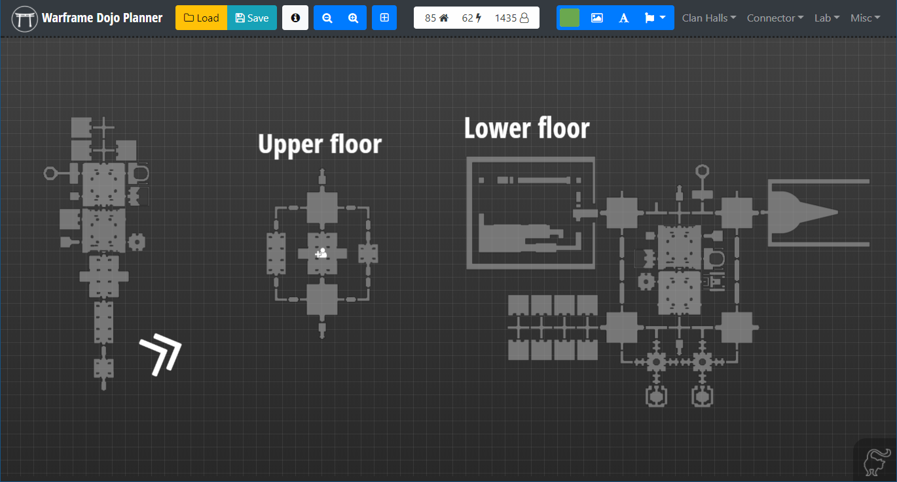

# Waframe Dojo Planner 
### A simple webapp to help you plan your Dojo

The Dojo Planner is available for use at: https://dojoplanner.stom66.co.uk

This app uses [jQuery](https://jquery.com/) and [Fabric.js](https://fabricjs.com/) to present a useable canvas for planning out a Dojo, and includes the various rooms as SVGs. It also allows custom text, images, and icons from [FontAwesome](https://fontawesome.com/). The results can be saved as an image.

Please excuse the crudity of this app. This code was thrown together over a couple of days and makes little effort to be efficient in any way. Fabric.js is buggy as hell and this thing is held  together with duct tape, spit and luck. 

If you're going to be tinkering with the code I apologise in advance, this thing is so full of cludge fixes I lost count. I've tried to throw in some useful console logging. It's not exactly verbose logging but it'll provide enough jumping off points, although admittedly I got distracted in some places making Clem have a bit of fun. 

No support for this code is provided. Seriously, none. I wrote this without the intention of future development, but you can feel free to adjust it/modify it/update it/destroy it for whatever you like. Just don't be an asshole. If you make any money from it, I'd like some of it. Simples!

